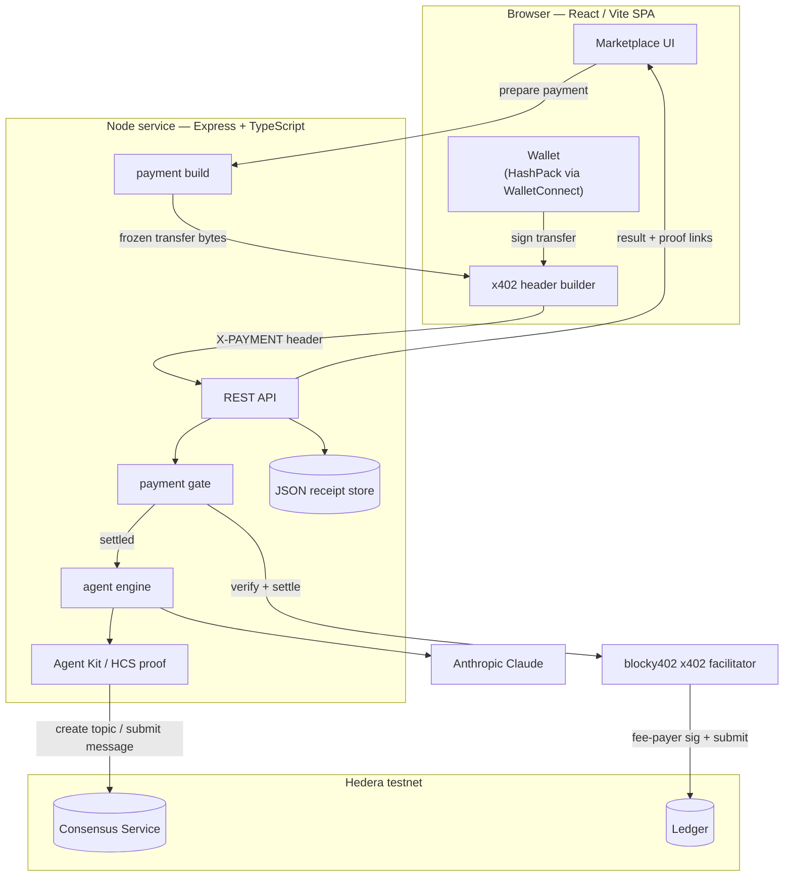
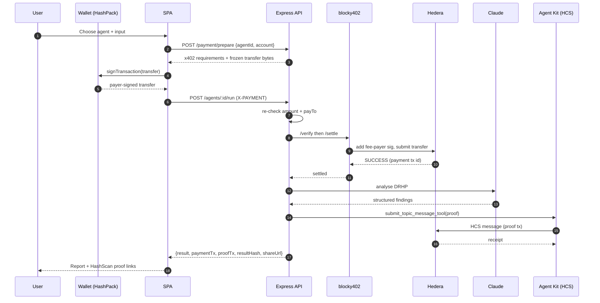
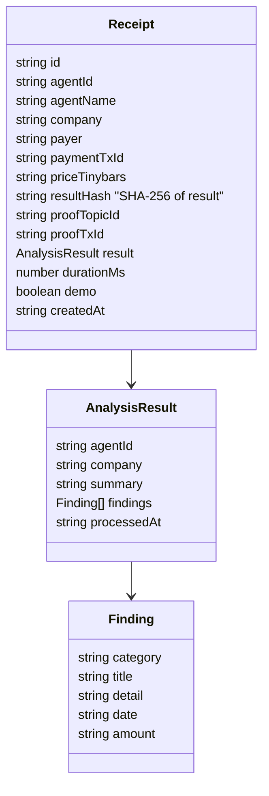

# CapScribe — Architecture

## System overview



## Pay-to-run sequence



## Proof-of-completion data model



The proof message published to HCS is:

```json
{
  "type": "capscribe.proof.v1",
  "agent": "risk-scan",
  "company": "Acme Industries Ltd",
  "payer": "0.0.xxxx",
  "paymentTxId": "0.0.7162784@...",
  "resultHash": "5c0179...917e",
  "findings": 4,
  "at": "2026-06-06T22:00:00.000Z"
}
```

Anyone can independently recompute `resultHash` from a shared receipt (`/r/:id`) and
match it against the on-chain HCS message — a verifiable audit trail with no trust in
CapScribe required.

## Repository layout

```
src/
  server.ts            Express app, static SPA, SPA fallback, shutdown
  config.ts            Zod-validated env
  logger.ts            pino
  store.ts             JSON receipt store + analytics
  types.ts             shared domain types
  agents/
    registry.ts        marketplace catalog (prices, reputation source)
    engine.ts          Claude-backed agents + multi-agent workflow
  hedera/
    client.ts          SDK client + key parsing
    paymentBuild.ts    x402 requirements + frozen transfer
    paymentGate.ts     facilitator verify + settle
    agentKit.ts        Hedera Agent Kit → HCS proof
  routes/api.ts        REST API
  middleware/          error handling + rate limiting
  util/                retry, hashing, HashScan links
  scripts/setupTopic.ts
web/                   React + Vite + Tailwind SPA → built into web/dist
tests/                 vitest unit tests
```
